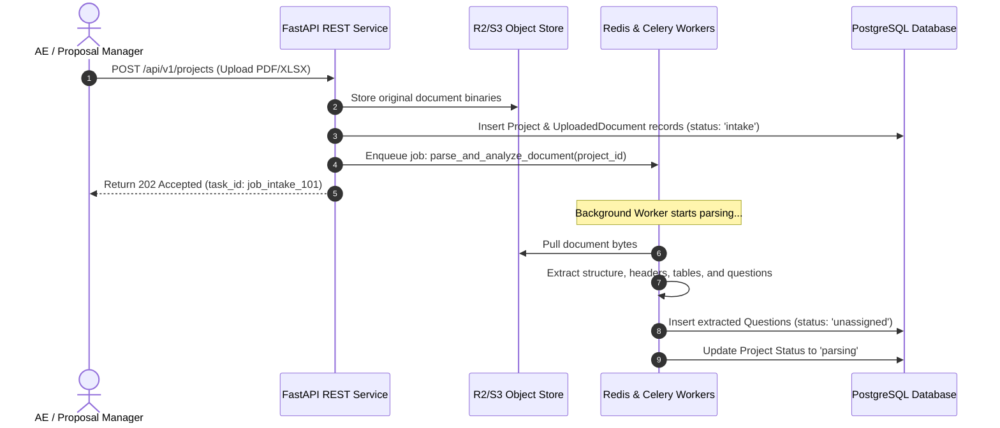
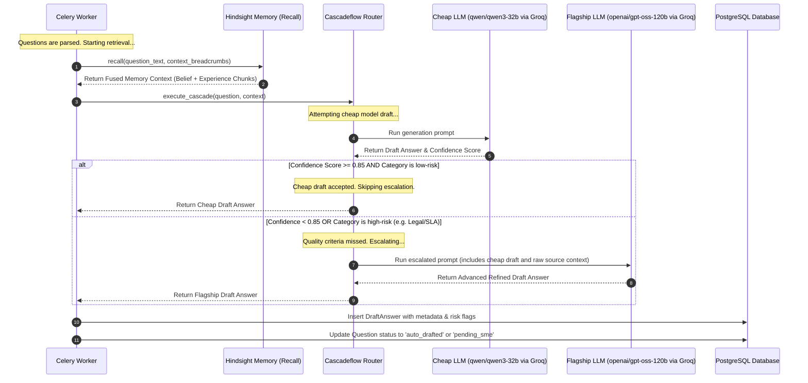
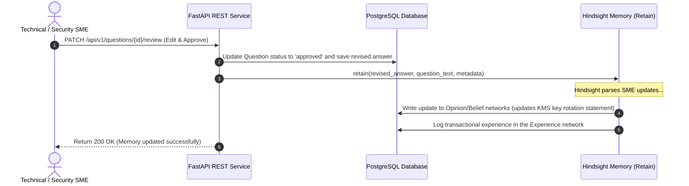

# PROPOSAL & RFP AI AGENT FOR ENTERPRISE B2B SALES
## Enterprise Architectural Blueprint & Technical Specification
### Powered by Hindsight Memory Architecture & Cascadeflow Speculative Routing

---

## 1. Product Definition & Value Proposition

### 1.1 Executive Summary
The **Enterprise Proposal & RFP Agent** is an autonomous multi-agent intelligence platform designed to revolutionize B2B sales cycles. By automating the end-to-end workflow of responding to Request for Proposals (RFPs), Request for Information (RFIs), security questionnaires (SIG/CAIQ), and vendor registration forms, the platform slashes response times by 70% while improving response accuracy and consistency.

Unlike standard conversational chatbots that generate text ad-hoc, this system is a **governed proposal operations assistant**. It utilizes retrieval-grounded generation, dual-engine routing, multi-role review workflows, and structured persistent memory to ensure that all submitted answers are verified, audited, compliant, and approved by human subject matter experts (SMEs).

```
                      +---------------------------------------+
                      |         Enterprise Intake             |
                      |  (PDFs, DOCX, Spreadsheets, Metadata) |
                      +-------------------+-------------------+
                                          |
                                          v
                      +-------------------+-------------------+
                      |      Cascadeflow Routing Engine       |
                      |  Speculative Routing & Cost Control   |
                      +-------+-----------------------+-------+
                              |                       |
             (Fast Path / Low Risk)          (Slow Path / High Risk)
             qwen/qwen3-32b (Groq)           openai/gpt-oss-120b (Groq)
                              |                       |
                              +-----------+-----------+
                                          |
                                          v
                      +-------------------+-------------------+
                      |       Hindsight Memory Engine         |
                      |   World, Experience, Belief, Entity   |
                      +-------------------+-------------------+
                                          |
                                          v
                      +-------------------+-------------------+
                      |       Collaborative Review Portal     |
                      |      (AE, SME, Security, Legal)       |
                      +---------------------------------------+
```

### 1.2 Core Value Propositions
* **70%+ Reduction in Drafting Cycle:** Automatically extracts and drafts up to 90% of technical, company, and security questionnaires in minutes instead of weeks.
* **100% Auditability and Grounding:** Every draft answer is strictly mapped to verified company sources with dynamic similarity scores and citation tracking, eliminating hallucinated product capabilities.
* **Lower Operating Costs via Speculative Cascading:** Uses the **Cascadeflow** runtime to route standard questions to faster, cheaper models, escalating to flagship models only for complex, high-risk security or legal queries.
* **Learning from Human Corrections:** Uses the **Hindsight** persistent memory framework to auto-update the content library using human corrections, tracking past experiences across multi-session bidding cycles.

---

## 2. Feature Breakdown by Functional Module

### 2.1 Intake & Metadata Extraction
* **Multi-Format Processing:** Supports direct uploads of PDF (text/scanned), DOCX, TXT, CSV, and XLSX formats.
* **Automatic Opportunity Identification:** Extracts key metadata: Buyer Name, Opportunity Value, Submission Instructions, Core Technologies requested, Deadlines, and Compliance requirements.
* **Requirement Extraction:** Isolates specific formatting instructions (e.g., word counts, specific response prefixes like "Yes/No with narrative").

### 2.2 Advanced Parsing & Table Normalization
* **Hierarchical Layout Parsing:** Parses document trees (Sections, Subsections, nested lists, and table structures) using structural markers and boundaries.
* **Grid and Spreadsheet Extractor:** Automatically normalizes spreadsheet questionnaires, preserving row alignments, cell coordinates, and existing response cells.
* **Context Preservation:** Associates questions with their preceding header text, section context, and instructions, ensuring the model understands context-specific terminology.

### 2.3 Question Classification
* **Taxonomy Engine:** Classifies questions into 10 key B2B domains:
  1. *Company Background & Financials*
  2. *Product Features & Architecture*
  3. *Integrations & APIs*
  4. *Implementation, Onboarding & Training*
  5. *Information Security & Cyber-hygiene*
  6. *Compliance, Privacy & SOC2/GDPR*
  7. *Legal, Liability & Indemnification*
  8. *Pricing & Commercial Terms*
  9. *SLA, Disaster Recovery & Support*
  10. *Customer Success & Case Studies*
* **Response Type Detection:** Classifies the requested output format (Binary Yes/No, Short Answer, Extended Paragraph, Document Attachment needed).

### 2.4 Content Library & Retrieval
* **Governed Memory Store:** Maintains a repository of master Q&A items, with fields for Category, Owner, Approval Status, Verification Date, Tags, and Scope.
* **Hybrid Retrieval System:** Combines vector-based semantic search (using cosine similarity on embeddings) with keyword-based full-text index searching.
* **Provenance and Traceability:** Mapped citations linking retrieved draft suggestions back to raw source files (e.g., SOC 2 Report Section 4.2).

### 2.5 Grounded Drafting
* **Adherence Controls:** Drafting prompts limit LLM output strictly to retrieved source information, replacing unverified claims with standard placeholders: `[INFORMATION NOT IN CONTEXT LIBRARY]`.
* **Dynamic Tone & Style Adapters:** Matches response styles to specific buyer personalities (e.g., highly technical vs executive-level) and complies with length/word count restrictions.

### 2.6 Confidence & Risk Scoring
* **Confidence Metric Formula:** Scores each answer (0.0 to 1.0) based on:
  $$\text{Confidence} = 0.4 \times (\text{Semantic Match}) + 0.3 \times (\text{Source Freshness}) + 0.3 \times (\text{Completeness})$$
* **Risk Flagging Engine:** Automatically raises warnings for:
  * *No Source Found* (Confidence < 0.3)
  * *Stale Source Content* (Source older than 180 days)
  * *Conflicting Source Content* (Conflicting product capabilities across sources)
  * *High-Risk Legal/SLA Commitment* (e.g., standard SLA is 99.9%, draft promises 99.99%)

### 2.7 Human-in-the-Loop Review & Routing
* **Task Routing Matrices:** Automatically assigns questions to target teams:
  * Security/Compliance domain $\rightarrow$ Security SME
  * Pricing/Commercial domain $\rightarrow$ Account Executive
  * Performance/Architecture domain $\rightarrow$ Engineering Lead
* **Visual Audit Trail:** Clear visual diff interface highlighting differences between Auto-Drafted, SME-Revised, and Final-Approved responses.

### 2.8 Proposal Composer & Packaging
* **Document Compilation Engine:** Compiles responses back into the buyer's original template structure (e.g., injection of draft answers back into specific columns in the buyer's uploaded Excel sheet, or a styled corporate Word document).
* **AI Executive Summary Generator:** Dynamically summarizes the RFP scope, highlighting the B2B vendor's primary differentiators tailored to the buyer's criteria.

### 2.9 Analytics & Library Governance
* **Analytics Dashboard:** Visual tracking of answer reuse rates, SME response speeds, high-frequency question domains, and content freshness.
* **Stale Content Workflows:** Periodically flags library items exceeding review periods (e.g., 6 months) and routes review tasks to registered content owners.

---

## 3. User Roles & Permissions (RBAC Matrix)

The platform supports robust enterprise operations with structured role-based access controls:

| Role | Description | Core Operations |
|---|---|---|
| **System Administrator** | Platform owner. | Complete environment control, integration configurations, user provisioning. |
| **Proposal Manager** | Response project owner. | Project creation, manual question routing, final document composition, template control. |
| **Account Executive (AE)** | Opportunity owner. | Intake uploads, status tracking, review of pricing and commercials, exports. |
| **SME Reviewer (Security/Tech/Product)** | Domain expert. | Domain-specific draft review, answer revision, approval, content library submission. |
| **Legal/Compliance Reviewer** | Legal gatekeeper. | Risk-flagged response review, SLA approval, master legal terms management. |
| **Executive Approver** | Executive gatekeeper. | Final sign-off on bids exceeding value thresholds or containing custom SLA commitments. |

---

## 4. End-to-End System Architecture

The platform architecture features decoupled services, combining a high-performance REST API with background workers and specialized memory/routing layers:

```
+-----------------------------------------------------------------------------------+
|                                 FRONTEND CLIENT                                   |
|   Next.js 14 App Router | React | TypeScript | Tailwind CSS | Radix UI / Shadcn   |
+----------------------------------------+------------------------------------------+
                                         |
                                         | REST APIs / WebSockets
                                         v
+-----------------------------------------------------------------------------------+
|                                 BACKEND SERVICES                                  |
|   FastAPI REST API (Uvicorn / Python 3.11)                                        |
|   - Authentication & Role-Based Access Control (RBAC)                             |
|   - Project & Entity REST Management                                              |
|   - Speculative Routing Orchestrator (Cascadeflow Engine)                         |
|   - Persistent Corporate Memory Interface (Hindsight Memory Engine)               |
+---------------+------------------------+--------------------------+---------------+
                |                        |                          |
                | Database Operations    | Push Jobs                | Read/Write Files
                v                        v                          v
+---------------+--------+   +-----------+------------+   +---------+---------------+
|   DATA STORAGE LAYER   |   |   TASK QUEUE / BROKER  |   |    FILE STORAGE LAYER   |
|  PostgreSQL 16         |   |  Redis 7 (Broker/Cache)|   |  AWS S3 or Cloudflare R2|
|  - pgvector (Embeddings|   +-----------+------------+   |  - Original RFP/RFIs     |
|  - Structured entities |               |                |  - Extracted Artifacts  |
|  - Audit Log logs      |               | Pull Jobs      |  - Generated Packages   |
+------------------------+               v                +-------------------------+
                             +-----------+------------+
                             |   ASYNC WORKER POOL    |
                             |  Celery Workers        |
                             |  - Document Parsers    |
                             |  - Vector Indexers     |
                             |  - AI Draft Generators |
                             +------------------------+
```

### 4.1 Hindsight Memory Integration
Instead of treating corporate knowledge as simple disconnected text chunks, the platform embeds the **Hindsight Memory Framework** as its primary library engine. The Content Library is structured across 4 distinct cognitive networks:
1. **World Network:** Holds external industry standards (e.g., SOC 2 compliance checklist criteria, ISO 27001 requirements, GDPR definitions).
2. **Experience Network:** Tracks historical RFP interactions, recording which answers were successful, which SME modified what, and the context of won/lost bids.
3. **Opinion & Belief Network:** Houses the company's internal claims, marketing angles, positioning, and strategic assertions (e.g., *"We believe our zero-trust architecture is 3x faster than traditional VPNs"*), each associated with a certainty/confidence metric.
4. **Entity/Observation Network:** Synthesizes profiles of target buyers (e.g., preferred technologies for *ApexBank*), competitors, and internally registered SMEs with their domains of competence.

* **Retain:** Triggered whenever an SME edits and approves a draft. The pipeline automatically calls `hindsight.retain()` to extract new relationships, entities, and beliefs, updating the Experience and Opinion networks.
* **Recall:** RAG queries execute the parallel retrieval pipeline, fetching contextual assets across all four networks, which are then fused and sorted by a Cross-Encoder Reranker.
* **Reflect:** A nightly background job runs the `reflect()` loop, identifying contradictory entries, flagging outdated facts in the library, and drafting recommendations to keep company knowledge synchronized.

### 4.2 Cascadeflow Speculative Routing Integration
LLM API costs and execution latencies can spiral out of control during complex document parsing and draft generation. To counter this, the **Cascadeflow Engine** is embedded directly within the asynchronous execution loop:

1. **Speculative Execution Path:** Questions are initially evaluated by a fast, highly cost-efficient model hosted on Groq (specifically, `qwen/qwen3-32b`).
2. **Deterministic Evaluation Check:** The resulting auto-draft and self-assessment confidence score are passed to a local evaluator:
   ```python
   is_acceptable = (
       draft_score.confidence >= 0.85 and 
       len(draft_score.risk_flags) == 0 and 
       draft_score.category not in ["legal", "pricing"]
   )
   ```
3. **Dynamic Escalation Path:** If `is_acceptable` evaluates to `False`, Cascadeflow intercepts the task and escalates it to a flagship model hosted on Groq (specifically, the massive open-weights flagship `openai/gpt-oss-120b`), passing the initial draft, reasoning history, and augmented retrieved memory context for advanced generation.
4. **Economic ROI:** Generates cost savings of 60%–80% for standard corporate and security questions, while reserving premium model intelligence for high-stakes compliance and legal segments.

---

## 5. Database Schema

The system uses PostgreSQL 16 with the `pgvector` extension enabled. The database schema enforces data integrity, maintains audit logs, and supports hybrid semantic search.

```sql
-- Enable vector extension
CREATE EXTENSION IF NOT EXISTS vector;

-- Enums
CREATE TYPE user_role AS ENUM ('admin', 'proposal_manager', 'sales_rep', 'sme_reviewer', 'legal_reviewer', 'executive');
CREATE TYPE project_status AS ENUM ('intake', 'parsing', 'drafting', 'reviewing', 'composed', 'exported', 'archived');
CREATE TYPE question_status AS ENUM ('unassigned', 'auto_drafted', 'pending_sme', 'approved', 'rejected', 'revised');
CREATE TYPE response_style AS ENUM ('short', 'yes_no_explanation', 'paragraph', 'formal');
CREATE TYPE memory_network_type AS ENUM ('world', 'experience', 'belief', 'entity');

-- Users Table
CREATE TABLE users (
    user_id UUID PRIMARY KEY DEFAULT gen_random_uuid(),
    email VARCHAR(255) UNIQUE NOT NULL,
    full_name VARCHAR(255) NOT NULL,
    role user_role NOT NULL,
    domain_expertise VARCHAR(100)[], -- e.g. {'security', 'pricing'}
    created_at TIMESTAMP WITH TIME ZONE DEFAULT CURRENT_TIMESTAMP,
    updated_at TIMESTAMP WITH TIME ZONE DEFAULT CURRENT_TIMESTAMP
);

-- Projects Table
CREATE TABLE projects (
    project_id UUID PRIMARY KEY DEFAULT gen_random_uuid(),
    buyer_name VARCHAR(255) NOT NULL,
    opportunity_name VARCHAR(255) NOT NULL,
    deadline TIMESTAMP WITH TIME ZONE NOT NULL,
    status project_status NOT NULL DEFAULT 'intake',
    owner_id UUID NOT NULL REFERENCES users(user_id) ON DELETE CASCADE,
    created_at TIMESTAMP WITH TIME ZONE DEFAULT CURRENT_TIMESTAMP,
    updated_at TIMESTAMP WITH TIME ZONE DEFAULT CURRENT_TIMESTAMP
);

-- Uploaded Documents Table
CREATE TABLE uploaded_documents (
    document_id UUID PRIMARY KEY DEFAULT gen_random_uuid(),
    project_id UUID NOT NULL REFERENCES projects(project_id) ON DELETE CASCADE,
    file_name VARCHAR(255) NOT NULL,
    file_type VARCHAR(50) NOT NULL, -- 'pdf', 'docx', 'xlsx'
    file_url VARCHAR(512) NOT NULL, -- S3/R2 path
    parsed_text TEXT,
    document_role VARCHAR(100) DEFAULT 'buyer_rfp', -- 'buyer_rfp', 'supporting_evidence'
    created_at TIMESTAMP WITH TIME ZONE DEFAULT CURRENT_TIMESTAMP
);

-- Content Library (Integrated with Hindsight Memory Framework)
CREATE TABLE content_library_items (
    content_id UUID PRIMARY KEY DEFAULT gen_random_uuid(),
    network memory_network_type NOT NULL DEFAULT 'belief',
    title VARCHAR(255) NOT NULL,
    question_text TEXT,
    answer_text TEXT NOT NULL,
    category VARCHAR(100) NOT NULL, -- 'security', 'pricing', etc.
    tags VARCHAR(50)[],
    source_document VARCHAR(255),
    owner_id UUID REFERENCES users(user_id) ON DELETE SET NULL,
    last_reviewed TIMESTAMP WITH TIME ZONE DEFAULT CURRENT_TIMESTAMP,
    is_approved BOOLEAN NOT NULL DEFAULT true,
    version INT NOT NULL DEFAULT 1,
    created_at TIMESTAMP WITH TIME ZONE DEFAULT CURRENT_TIMESTAMP,
    updated_at TIMESTAMP WITH TIME ZONE DEFAULT CURRENT_TIMESTAMP
);

-- pgvector Indexing for Content Library
CREATE TABLE content_embeddings (
    embedding_id UUID PRIMARY KEY DEFAULT gen_random_uuid(),
    content_id UUID NOT NULL REFERENCES content_library_items(content_id) ON DELETE CASCADE,
    chunk_text TEXT NOT NULL,
    embedding vector(1536) NOT NULL -- For OpenAI 3rd-Gen embeddings
);
CREATE INDEX ON content_embeddings USING hnsw (embedding vector_cosine_ops);

-- Questions Table
CREATE TABLE questions (
    question_id UUID PRIMARY KEY DEFAULT gen_random_uuid(),
    project_id UUID NOT NULL REFERENCES projects(project_id) ON DELETE CASCADE,
    document_id UUID REFERENCES uploaded_documents(document_id) ON DELETE SET NULL,
    section_name VARCHAR(255),
    raw_text TEXT NOT NULL,
    normalized_text TEXT NOT NULL,
    category VARCHAR(100) NOT NULL,
    response_type VARCHAR(50) DEFAULT 'paragraph',
    priority VARCHAR(20) DEFAULT 'medium', -- 'low', 'medium', 'high'
    assigned_to UUID REFERENCES users(user_id) ON DELETE SET NULL,
    status question_status NOT NULL DEFAULT 'unassigned',
    created_at TIMESTAMP WITH TIME ZONE DEFAULT CURRENT_TIMESTAMP,
    updated_at TIMESTAMP WITH TIME ZONE DEFAULT CURRENT_TIMESTAMP
);

-- Retrieved Evidence (Mapping Questions to Library Items)
CREATE TABLE retrieved_evidence (
    retrieval_id UUID PRIMARY KEY DEFAULT gen_random_uuid(),
    question_id UUID NOT NULL REFERENCES questions(question_id) ON DELETE CASCADE,
    content_id UUID NOT NULL REFERENCES content_library_items(content_id) ON DELETE CASCADE,
    similarity_score NUMERIC(5,4) NOT NULL,
    citation_text TEXT,
    retrieved_at TIMESTAMP WITH TIME ZONE DEFAULT CURRENT_TIMESTAMP
);

-- Draft Answers (Generated & Scored, supports Cascadeflow escalation details)
CREATE TABLE draft_answers (
    draft_id UUID PRIMARY KEY DEFAULT gen_random_uuid(),
    question_id UUID NOT NULL REFERENCES questions(question_id) ON DELETE CASCADE,
    generated_answer TEXT NOT NULL,
    confidence_score NUMERIC(5,4) NOT NULL,
    risk_flags VARCHAR(100)[], -- {'no_source', 'outdated_source', 'sla_mismatch'}
    sources_used UUID[], -- references content_library_items
    cascade_escalated BOOLEAN NOT NULL DEFAULT false,
    cascade_reason VARCHAR(255),
    created_at TIMESTAMP WITH TIME ZONE DEFAULT CURRENT_TIMESTAMP,
    updated_at TIMESTAMP WITH TIME ZONE DEFAULT CURRENT_TIMESTAMP
);

-- Review Tasks
CREATE TABLE review_tasks (
    task_id UUID PRIMARY KEY DEFAULT gen_random_uuid(),
    question_id UUID NOT NULL REFERENCES questions(question_id) ON DELETE CASCADE,
    assigned_to UUID NOT NULL REFERENCES users(user_id) ON DELETE CASCADE,
    due_date TIMESTAMP WITH TIME ZONE NOT NULL,
    comments TEXT,
    final_decision VARCHAR(50) NOT NULL DEFAULT 'pending', -- 'approved', 'rejected', 'revised'
    created_at TIMESTAMP WITH TIME ZONE DEFAULT CURRENT_TIMESTAMP,
    updated_at TIMESTAMP WITH TIME ZONE DEFAULT CURRENT_TIMESTAMP
);

-- Export Packages
CREATE TABLE export_packages (
    export_id UUID PRIMARY KEY DEFAULT gen_random_uuid(),
    project_id UUID NOT NULL REFERENCES projects(project_id) ON DELETE CASCADE,
    format VARCHAR(50) NOT NULL, -- 'docx', 'xlsx', 'pdf'
    version INT NOT NULL DEFAULT 1,
    file_url VARCHAR(512) NOT NULL, -- S3/R2 export path
    generated_at TIMESTAMP WITH TIME ZONE DEFAULT CURRENT_TIMESTAMP,
    generated_by UUID NOT NULL REFERENCES users(user_id)
);
```

---

## 6. API Design (OpenAPI Specification Format)

Here are the primary endpoints engineered to drive the asynchronous proposal workflow. All inputs and outputs are strictly formatted as typed JSON.

### 6.1 Create Project & Upload Document
* **Endpoint:** `POST /api/v1/projects`
* **Content-Type:** `multipart/form-data`
* **Payload:**
  * `buyer_name`: `"ApexBank"`
  * `opportunity_name`: `"Core Security Shield RFP"`
  * `deadline`: `"2026-06-15T23:59:59Z"`
  * `files`: `[Binary PDF/DOCX Uploads]`
* **Response:** (Status `202 Accepted`)
  ```json
  {
    "project_id": "76495b21-4f10-4d51-bb5c-74a62174c8de",
    "buyer_name": "ApexBank",
    "opportunity_name": "Core Security Shield RFP",
    "status": "intake",
    "deadline": "2026-06-15T23:59:59Z",
    "uploaded_files": [
      {
        "document_id": "11985cde-47ab-43cd-8877-0096238b72de",
        "file_name": "ApexBank_Sec_Questionnaire_2026.docx",
        "file_type": "docx"
      }
    ],
    "task_id": "job_intake_8847291104",
    "message": "Project initiated successfully. Processing and ingestion scheduled asynchronously."
  }
  ```

### 6.2 Get Question Extraction Status
* **Endpoint:** `GET /api/v1/projects/{project_id}/questions`
* **Response:** (Status `200 OK`)
  ```json
  {
    "project_id": "76495b21-4f10-4d51-bb5c-74a62174c8de",
    "total_questions": 124,
    "status_counts": {
      "unassigned": 0,
      "auto_drafted": 92,
      "pending_sme": 32,
      "approved": 0
    },
    "questions": [
      {
        "question_id": "55127eac-cf19-4822-aee7-f81d89163e9c",
        "section_name": "3. Data Encryption",
        "raw_text": "Do you encrypt data at rest using AES-256?",
        "normalized_text": "Do you encrypt data at rest using AES-256?",
        "category": "security",
        "response_type": "yes_no_explanation",
        "status": "auto_drafted",
        "assigned_to": "sme_user_5521e",
        "draft": {
          "draft_id": "d0947e11-192a-48cc-8871-3329188ebcd1",
          "generated_answer": "Yes. AegisCore encrypts all customer data at rest within production databases and cloud storage volumes using FIPS 140-2 validated AES-256 encryption. Cryptographic keys are managed via AWS Key Management Service (KMS) and rotated automatically on an annual cycle.",
          "confidence_score": 0.9840,
          "risk_flags": [],
          "cascade_escalated": false,
          "sources_used": [
            {
              "content_id": "c11958bb-dd39-440d-b873-1996238321aa",
              "title": "Corporate Cryptographic Key Governance Standard",
              "similarity_score": 0.9421
            }
          ]
        }
      }
    ]
  }
  ```

### 6.3 Update Response (SME Edits and Approval)
* **Endpoint:** `PATCH /api/v1/questions/{question_id}/review`
* **Payload:**
  ```json
  {
    "reviewer_id": "sme_user_5521e",
    "action": "approved",
    "revised_answer": "Yes. AegisCore encrypts all customer data at rest in production systems using AES-256. Cryptographic keys are managed via AWS Key Management Service (KMS) with monthly auto-rotation rather than annual, aligned with our SOC 2 Type II assurance controls.",
    "comments": "Slight correction: Key rotation is monthly as per our updated ISO/SOC compliance controls."
  }
  ```
* **Response:** (Status `200 OK`)
  ```json
  {
    "question_id": "55127eac-cf19-4822-aee7-f81d89163e9c",
    "status": "approved",
    "assigned_to": null,
    "last_updated": "2026-05-19T13:47:30Z",
    "hindsight_retention": {
      "status": "updated_successfully",
      "records_updated": 1,
      "networks_impacted": ["opinion", "experience"],
      "message": "Memory retained successfully. Hindsight has updated AegisCore's KMS Key Rotation statement within the Opinion and Experience network substrates."
    }
  }
  ```

### 6.4 Compose & Export Final Response Package
* **Endpoint:** `POST /api/v1/projects/{project_id}/compose`
* **Payload:**
  ```json
  {
    "requested_format": "docx",
    "apply_branding_template_id": "corporate_branding_theme_blue",
    "generate_executive_summary": true
  }
  ```
* **Response:** (Status `202 Accepted`)
  ```json
  {
    "project_id": "76495b21-4f10-4d51-bb5c-74a62174c8de",
    "export_id": "ee04721a-4712-4d81-884b-001a736fcd1a",
    "task_id": "job_compose_992817730",
    "status": "processing",
    "message": "Document composition initialized. The response table is being written back into the template format."
  }
  ```

---

## 7. Multi-Agent System: Prompt Designs

Below are complete, production-grade prompt templates for all 9 agents within the multi-agent design, structured for execution within LLMs.

### 7.1 Intake Agent
```markdown
SYSTEM INSTRUCTIONS:
You are an expert Document Intake Agent specializing in B2B enterprise procurement documents. Your task is to analyze the raw ingested text from an uploaded document, identify the document type, extract metadata, isolate delivery deadlines, and compile submission instructions.

Analyze the raw text and return a strict JSON payload mapping the structural requirements.

EXPECTED JSON SCHEMA:
{
  "buyer_name": "string or null",
  "opportunity_name": "string or null",
  "deadline": "ISO 8601 DateTime or null",
  "submission_instructions": "string",
  "formatting_rules": {
    "response_prefix_required": "string or null",
    "word_limit": "integer or null",
    "required_attachments": ["string"]
  },
  "compliance_frameworks_referenced": ["string"]
}

RAW DOCUMENT CONTENT:
{raw_document_text}
```

### 7.2 Parsing Agent
```markdown
SYSTEM INSTRUCTIONS:
You are a structural Document Parsing Agent. Your role is to segment unstructured documents (PDFs, DOCX, or text) into hierarchical components. Identify sections, header elements, tables, and individual buyer questions.

Ensure every question maintains its exact context (parent headers, preceding contextual instructions, or table column titles). Clean unnecessary whitespace, but do not alter spelling or structure of the buyer's query.

EXPECTED JSON SCHEMA:
{
  "sections": [
    {
      "section_id": "string",
      "section_title": "string",
      "questions": [
        {
          "question_id": "string",
          "raw_text": "string",
          "context_breadcrumbs": "string",
          "estimated_char_limit": "integer or null"
        }
      ]
    }
  ]
}

RAW INPUT SEGMENT:
{input_segment_text}
```

### 7.3 Classification Agent
```markdown
SYSTEM INSTRUCTIONS:
You are a Classification Agent. Your role is to categorize buyer queries into domain categories and define response types.

CLASSIFICATION TAXONOMY:
- "company_background"
- "product_capabilities"
- "integrations_api"
- "implementation_onboarding"
- "security"
- "compliance_privacy"
- "legal_contractual"
- "pricing_commercial"
- "sla_support"
- "references"

RESPONSE FORMATS:
- "binary_yes_no"
- "short_answer"
- "detailed_paragraph"
- "document_reference"

INPUT QUESTION:
"{question_text}"

CONTEXT BREADCRUMBS:
"{context_breadcrumbs}"

EXPECTED JSON SCHEMA:
{
  "category": "string",
  "response_format_requested": "string",
  "priority": "low" | "medium" | "high",
  "domain_rationale": "string"
}
```

### 7.4 Retrieval Agent (Integrated with Hindsight Memory)
```markdown
SYSTEM INSTRUCTIONS:
You are a Retrieval Agent operating over a multi-network Hindsight corporate memory layer. Your goal is to map the user's question to relevant facts, historical experiences, corporate beliefs, and observer entity profiles.

Given the buyer query, formulate optimal search terms for:
1. Semantic dense queries (for embedding match)
2. Keyword sparse queries (for exact terminologies like "SOC 2 Type II" or "AES-256")
3. Historical experience graph pathways (retrieve similar questions answered in winning proposals)

INPUT QUESTION:
"{question_text}"

EXPECTED JSON SCHEMA:
{
  "dense_search_vector_query": "string",
  "sparse_keyword_terms": ["string"],
  "historical_won_proposal_context": "string",
  "entity_target_profile": "string"
}
```

### 7.5 Drafting Agent (Grounded Generation)
```markdown
SYSTEM INSTRUCTIONS:
You are a Drafting Agent. Your absolute priority is to draft precise, highly professional, and strictly grounded response options.

RULE 1: Ground your entire response ONLY on the provided retrieved memory chunks from the Hindsight Memory layer.
RULE 2: If the retrieved documents do not provide evidence for a specific claim or request, do not invent. Instead, write exactly: "[INFORMATION NOT IN CONTEXT LIBRARY]".
RULE 3: Match the requested format and word constraints.
RULE 4: Support assertions with inline citations pointing to the document source.

Retrieved Hindsight Memory Chunks:
{retrieved_memory_chunks}

Buyer Question:
"{question_text}"

Requested Format:
{response_format_requested}

EXPECTED RESPONSE FORMAT:
Draft: [Your drafted response]
Sources Cited: [List source document names and matching sections]
```

### 7.6 Risk Scoring Agent (Cascadeflow Quality Evaluator)
```markdown
SYSTEM INSTRUCTIONS:
You are a Risk & Confidence Engine. Analyze a generated draft answer against its retrieved sources and buyer question. Calculate a confidence metric, detect risks, and flag compliance or legal hazards.

COMPUTE METRICS:
1. Grounding Score (0.0 to 1.0): Are there any ungrounded assertions?
2. Freshness Score (0.0 to 1.0): Are source documents outdated (>180 days)?
3. Completeness Score (0.0 to 1.0): Does the draft fully answer all sub-parts of the question?

DRAFT ANSWER:
"{draft_answer}"

RETRIEVED SOURCE DOCUMENTS:
{retrieved_sources}

BUYER QUESTION:
"{buyer_question}"

EXPECTED JSON SCHEMA:
{
  "confidence_score": 0.00,
  "grounding_score": 0.00,
  "freshness_score": 0.00,
  "completeness_score": 0.00,
  "risk_flags": ["no_source" | "outdated_source" | "unsupported_claim" | "sla_mismatch" | "legal_review_required"],
  "audit_trail_validations": "string (brief assessment explanation)",
  "cascade_escalation_recommendation": boolean
}
```

### 7.7 SME Routing Agent
```markdown
SYSTEM INSTRUCTIONS:
You are a Subject Matter Expert Routing Agent. Your task is to review a question, its classification, and its draft risk analysis, and assign the task to the registered SME with the correct domain expertise.

SME REGISTRATION DICTIONARY:
{sme_registration_dictionary}

INPUT DETAILS:
- Question: "{question_text}"
- Domain Category: "{category}"
- Risk Flags: {risk_flags}

EXPECTED JSON SCHEMA:
{
  "assigned_user_id": "string",
  "urgency": "low" | "medium" | "high",
  "routing_rationale": "string",
  "recommended_due_date": "ISO 8601 Date"
}
```

### 7.8 Proposal Composer Agent
```markdown
SYSTEM INSTRUCTIONS:
You are the Proposal Composer Agent. Your task is to aggregate all SME-approved answers into a structured final proposal.
Additionally, read the aggregated responses, user profile, and buyer context to write an executive summary that outlines:
1. AegisCore's understanding of the buyer's challenges.
2. Value propositions (grounded in the approved answers).
3. Summary of compliance alignments (e.g. SOC2, ISO27001).

APPROVED QUESTIONS & RESPONSES:
{approved_questions_responses}

EXPECTED JSON SCHEMA:
{
  "executive_summary": "string",
  "section_summaries": [
    {
      "section_title": "string",
      "summary_text": "string"
    }
  ]
}
```

### 7.9 Knowledge Governance Agent (Hindsight Reflection)
```markdown
SYSTEM INSTRUCTIONS:
You are the Knowledge Governance Agent operating over the Hindsight Memory layer. Your objective is to run the reflective consolidation cycle.
Compare historical drafts, human SME changes, and new documentation to spot:
1. Outdated assertions in the Belief network contradicted by new facts.
2. Duplicate answers that can be merged.
3. Emerging patterns of buyer questions that require fresh documentation.

MEMORY SUBSTRATES FOR CONSOLIDATION:
{recent_memory_dumps}

EXPECTED JSON SCHEMA:
{
  "consolidation_actions": [
    {
      "action_type": "flag_stale" | "suggest_merge" | "draft_new_knowledge",
      "target_content_ids": ["string"],
      "explanation": "string",
      "suggested_revision": "string"
    }
  ]
}
```

---

## 8. Suggested Technology Stack & Packages

The technical choices are engineered for speed, scalability, type safety, and seamless AI RAG capabilities:

| Layer | Technical Component | Purpose & Justification |
|---|---|---|
| **Frontend** | Next.js 14 (App Router) | React framework offering fast rendering, Server-Side Rendering (SSR) for initial loads, and integrated API routing. |
| **Styling** | Vanilla CSS + Tailwind CSS | For premium aesthetics, responsive grid design, fluid transitions, and fast iterations. |
| **Components** | Radix UI + shadcn/ui | Accessible, highly customizable unstyled component primitives for building sleek dashboards. |
| **Backend API** | FastAPI (Python 3.11) | Lightweight, typed, high-performance API backend. Native Pydantic integration simplifies JSON parsing. |
| **Database** | PostgreSQL 16 | Primary relational database for transactions, projects, users, status states, and audit trails. |
| **Vector Search** | pgvector (PostgreSQL) | Native embedding storage and HNSW indexing, keeping relational data and vector data in a single system. |
| **Cache & Broker** | Redis 7 | High-speed cache and message broker for handling asynchronous processing queues and WebSocket states. |
| **Task Queue** | Celery | Robust background worker orchestration to execute file parsing, embedding, drafting, and PDF exports. |
| **Object Storage** | Cloudflare R2 / AWS S3 | Secure, highly available storage for uploaded questionnaires, supporting assets, and exported packages. |
| **Document Parsers** | PyMuPDF & python-docx | High-speed processing libraries for extracting clean text, layouts, and structures from PDFs and Word documents. |
| **Spreadsheet Engine** | pandas + openpyxl | Precise parsing of Excel/CSV questionnaires, allowing programmatic cell traversal and direct writing. |
| **AI Orchestration** | LangChain / Custom Python | Custom Python pipelines for orchestrating Hindsight memory networks and Cascadeflow speculative routing. |
| **Embeddings** | OpenAI text-embedding-3-small | State-of-the-art 1536-dimensional semantic representation of library Q&A chunks. |
| **Orchestration LLM**| qwen/qwen3-32b & openai/gpt-oss-120b | Paired in a Cascadeflow configuration hosted on Groq to balance extreme speed and cost-effectiveness with reasoning capabilities. |

---

## 9. UI/UX Design System & Pages

### 9.1 Theme & Premium Visual Tokens (Vanilla CSS Design Tokens)
To deliver a high-end, visual aesthetic that looks state-of-the-art, the application uses CSS Variables for colors, shadows, and fonts:

```css
@import url('https://fonts.googleapis.com/css2?family=Outfit:wght@300;400;500;600;700&family=Plus+Jakarta+Sans:wght@300;400;500;600;700&display=swap');

:root {
  /* Elegant Dark UI color palette */
  --bg-primary: #0a0c10;
  --bg-secondary: #121620;
  --bg-tertiary: #1a2030;
  --bg-glass: rgba(18, 22, 32, 0.7);
  
  /* Vibrant Accent Neon Colors */
  --accent-cyan: #00f0ff;
  --accent-blue: #3b82f6;
  --accent-purple: #8b5cf6;
  
  /* Status Colors */
  --color-success: #10b981;
  --color-warning: #f59e0b;
  --color-danger: #ef4444;
  --color-info: #06b6d4;
  
  /* Typography */
  --font-display: 'Outfit', -apple-system, BlinkMacSystemFont, sans-serif;
  --font-sans: 'Plus Jakarta Sans', -apple-system, BlinkMacSystemFont, sans-serif;
  
  /* Styling Effects */
  --border-radius-sm: 8px;
  --border-radius-md: 12px;
  --border-radius-lg: 20px;
  
  --shadow-neon: 0 0 20px rgba(0, 240, 255, 0.15);
  --shadow-card: 0 4px 30px rgba(0, 0, 0, 0.4);
  --border-glow: 1px solid rgba(255, 255, 255, 0.08);
}

body {
  background-color: var(--bg-primary);
  color: #f3f4f6;
  font-family: var(--font-sans);
  margin: 0;
  overflow-x: hidden;
}

/* Glassmorphism card utility */
.card-glass {
  background: var(--bg-glass);
  backdrop-filter: blur(12px);
  -webkit-backdrop-filter: blur(12px);
  border: var(--border-glow);
  border-radius: var(--border-radius-md);
  box-shadow: var(--shadow-card);
  transition: all 0.3s cubic-bezier(0.4, 0, 0.2, 1);
}

.card-glass:hover {
  border-color: rgba(0, 240, 255, 0.3);
  box-shadow: var(--shadow-neon);
  transform: translateY(-2px);
}
```

### 9.2 Key UI Workspaces

#### 1. Core Operations Dashboard
* **Purpose:** High-level view of all RFP/RFI projects, real-time deadlines, response progress trackers, and direct upload intakes.
* **Layout:** Three-column grid configuration:
  * *Left Sidebar:* Dynamic Navigation (Projects, Content Library, SME Tasks, Analytics, Settings) and a quick user-profile status indicator showing domain permissions.
  * *Center Canvas:* Ingestion card featuring a drag-and-drop file uploader with glassmorphic glow borders. Below, a tabular view of all active projects with animated progress bars (showing `% Auto-Drafted` vs `% SME Approved`) and color-coded priority indicators based on deadline urgency.
  * *Right Panel:* Action-oriented activity feeds highlighting incoming SLA alerts and new SME tasks assigned to the user.

```
+-----------------------------------------------------------------------------------+
|  LOGO  [Search Questions...]                                         Profile  (PM) |
+-----------------+-------------------------------------------------+---------------+
|  NAV BAR        |  PROJECTS DASHBOARD                             |  SME QUEUE    |
|                 |  +-------------------------------------------+  |               |
|  [x] Dashboard  |  | Drag & Drop Ingest File                   |  | Task #1041    |
|  [ ] Library    |  | (PDF, DOCX, XLSX)                         |  | Security - AE |
|  [ ] Analytics  |  +-------------------------------------------+  | Due in 2 hrs  |
|  [ ] SME Tasks  |                                                 |               |
|  [ ] Settings   |  ACTIVE RFPs                                    | Task #1089    |
|                 |  1. ApexBank Sec    [======== 84%]  High Risk   | Legal SLA     |
|                 |  2. Chevron Bid     [====     40%]  On Track    | Due Tomorrow  |
+-----------------+-------------------------------------------------+---------------+
```

#### 2. Interactive Collaborative Workspace (SME & PM Review Screen)
* **Purpose:** Main screen for comparing generated answers, reviewing risk alerts, editing responses, and tracking citations.
* **Layout:** Split-pane design:
  * *Left Panel:* List of parsed questions with filter controls (e.g., status, domain, risk-level). Cards display status badges:
    * `AUTO-DRAFTED` (purple badge)
    * `PENDING REVIEW` (orange badge)
    * `APPROVED` (green badge)
  * *Center Panel:* Active editing canvas displaying:
    1. The buyer's original question and breadcrumb context.
    2. Rich text editor populated with the auto-drafted response.
    3. Interactive confidence meter (0-100%) and expandable risk alert banners (e.g., SLA contradictions).
  * *Right Panel:* Sidebar containing:
    1. **Retrieved Context Cards:** Clickable citation links matching the current question. Shows direct text quotes and similarity metrics.
    2. **Hindsight Memory Trace:** Visualizes historical answer iterations, user comments, and won/lost project usage records for auditability.

```
+-----------------------------------------------------------------------------------+
| < Back to Project         ApexBank Security Questionnaire             [Export DOCX] |
+------------------+----------------------------------------+-----------------------+
| QUESTION LIST    | REVIEW & EDIT SECTION                  | CITATIONS & EVIDENCE  |
|                  | Section 3: Key Rotation                |                       |
| 1. Key Length    | "Do you rotate master encryption keys?"| [Doc 1] Key Governance|
|    [ Approved  ] |                                        | Matches: 94.2%        |
|                  | Auto-Draft Response:                   | "Keys rotated every   |
| 2. Key Rotation  | +------------------------------------+ | 30 days via KMS..."   |
|    [Pending SME] | | Yes. AegisCore rotates keys...     |                       |
|                  | +------------------------------------+ | [Doc 2] SOC2 Section 4|
| 3. Storage Vol   |                                        | Matches: 88.0%        |
|    [Auto Draft ] | Score: 98%  [ No Risks Detected ]      | "Standard policies..."|
+------------------+----------------------------------------+-----------------------+
```

---

## 10. Implementation Roadmap (MVP vs. Advanced System)

The implementation strategy balances initial validation with long-term enterprise scalability:

```
                  +---------------------------------------+
                  |            PHASE 1: MVP               |
                  |  - Ingestion: PDF/DOCX Parsing        |
                  |  - Semantic Search (pgvector)         |
                  |  - LLM Drafting (OpenAI APIs)          |
                  |  - Basic Response Editing Sheet       |
                  +-------------------+-------------------+
                                      |
                                      v
                  +-------------------+-------------------+
                  |        PHASE 2: ENTERPRISE            |
                  |  - Hindsight Persistent Memory        |
                  |  - Cascadeflow Speculative Routing    |
                  |  - SME Workflows & Routing Rules      |
                  |  - Native Excel Template Writing      |
                  +-------------------+-------------------+
                                      |
                                      v
                  +-------------------+-------------------+
                  |         PHASE 3: GOVERNED             |
                  |  - Hybrid Vector/Graph Indexing       |
                  |  - Automated Compliance Reflection    |
                  |  - Fine-Tuned Local Models            |
                  +---------------------------------------+
```

| Ingestion & Drafting Feature | MVP Scope (Phase 1) | Advanced System (Phase 2 & 3) |
|---|---|---|
| **Ingestion Support** | Parses single standard PDF/DOCX files. | Batch document uploads, OCR for scanned PDFs, multi-tab Excel sheets. |
| **Parsing Engine** | Simple line and paragraph splitters. | Layout-aware structural extraction, preservation of nested tables. |
| **Knowledge Retrieval** | Basic vector lookup via pgvector. | **Hindsight memory framework** across 4 logical cognitive networks. |
| **Draft Orchestration** | Standard single-call LLM completion. | **Cascadeflow speculative cascading** for cost-optimized routing. |
| **Review Workflows** | Single editor workspace for all users. | Domain-specific SME assignments, task tracking, and role-based permissions. |
| **Document Composition** | Exports answers in a simple flat table. | Formatted write-back into the buyer's original DOCX or Excel template. |
| **Analytics Engine** | Basic dashboard showing response rates. | Comprehensive metrics on won/lost answers, accuracy tracking, and library refresh loops. |

---

## 11. Core System Workflows

Here is the exact technical execution flow of the system, showing how it orchestrates API calls, background tasks, and AI engines to process proposals.

### 11.1 Document Intake & Parsing Workflow


### 11.2 Retrieval & Speculative Cascading Drafting Workflow
This sequence shows the speculative routing engine (**Cascadeflow**) and persistent memory layer (**Hindsight**) in action:



### 11.3 Collaborative Human Review & Hindsight Retention Workflow


---

## 12. Key Risks & Enterprise Mitigations

```
               +---------------------------------------+
               |        CRITICAL SECURITY GAP          |
               |  Uploading sensitive vendor forms     |
               |  risks leaking proprietary data.       |
               +-------------------+-------------------+
                                   |
                                   v
               +-------------------+-------------------+
               |        ENGINEERED MITIGATION          |
               |  Apply PII/data scrubbing patterns   |
               |  prior to vectorizing and sending     |
               |  to external LLM provider loops.      |
               +---------------------------------------+
```

### 12.1 Hallucinations and Fabricated Product Capabilities
* **Risk:** The LLM drafts a highly convincing response asserting that the vendor has a specific security control (e.g. *"Our system runs real-time homomorphic encryption"*), when no such technology exists.
* **Mitigation:** Strictly enforce Grounded Generation rules. Prompt structures reject all external capabilities, replacing ungrounded claims with the placeholder `[INFORMATION NOT IN CONTEXT LIBRARY]`. System flags any answer containing this placeholder for mandatory human SME review.

### 12.2 Intellectual Property Leakage & Sensitive Data Sharing
* **Risk:** Ingesting proprietary client source files (e.g., draft pricing models, unsigned custom SLAs) and passing them directly to external API loops.
* **Mitigation:** Ingested context boundaries are isolated at the workspace level. Implement client-side data scrubbing patterns, removing PII (Personally Identifiable Information), IP addresses, and database credentials before data is processed by the vector storage engine.

### 12.3 Library Stale Data Drift (Information Decay)
* **Risk:** The content library retains approved questions from three years ago, leading the agent to generate outdated answers (e.g., claiming support for deprecated API endpoints).
* **Mitigation:** Integrate the **Hindsight Reflect** engine. Nightly background sweeps check for items with high revision rates or old timestamps. Stale items are flagged, and revision tasks are automatically routed to the designated content owner.

---

## 13. End-to-End Production Demo Scenario

To illustrate the capabilities of the system, this demo traces how a fictitious software vendor (**AegisCore**) responds to a technical and security RFP from **ApexBank**.

### 13.1 Step 1: Document Intake & Extracted Metadata
The Account Executive uploads the file `ApexBank_Security_RFP_V2.pdf`.
* **Buyer Name:** ApexBank
* **Deadline:** June 15, 2026
* **Key Guidelines Identified:** Responses must be explicitly stated as Yes/No with supporting narrative, and cannot exceed 100 words per item.

### 13.2 Step 2: Extraction & Categorization
The Parsing Agent identifies two complex questions in the raw text:
* **Question 1:** *"What encryption algorithms do you use to secure data in transit?"*
  * *Category:* `security`
  * *Requested Format:* `short_answer`
* **Question 2:** *"Does your organization guarantee a 99.99% service availability SLA?"*
  * *Category:* `legal_contractual`
  * *Requested Format:* `binary_yes_no`

### 13.3 Step 3: Retrieval & Cascadeflow Drafting Execution

#### Question 1 (Security - Standard Ingress Encryption)
* **Retrieved Facts:**
  * *Belief Network:* AegisCore protects data in transit using TLS 1.3. AES-128 is deprecated.
  * *Experience Network:* Similar questions in the Chevron RFP were answered with standard TLS 1.3 references.
* **Cascadeflow Routing:** Routed to the high-speed `qwen/qwen3-32b` via Groq (cheap path).
* **Generated Answer:**
  > "AegisCore secures all data in transit across public networks using Transport Layer Security (TLS) 1.3. Cryptographic connections negotiate strong cipher suites, specifically ECDHE-RSA-AES256-GCM-SHA384, to protect data against unauthorized interception. TLS 1.2 is supported as a legacy fallback, while insecure configurations (TLS 1.0, TLS 1.1) are explicitly disabled across all endpoints."
* **Evaluator Check:** Confidence: `0.97`, Risk Flags: `None`. Passed to SME queue as **Approved for Auto-Draft**.

#### Question 2 (Legal/SLA - Contractual Commitment)
* **Retrieved Facts:**
  * *Belief Network:* Master Service Agreement (MSA) promises a standard availability SLA of 99.9%.
  * *Experience Network:* The executive team previously approved a custom 99.99% SLA for Chevron, but it required an additional 15% pricing premium.
* **Cascadeflow Routing:** Routed initially to `qwen/qwen3-32b`. The mini model generates a draft agreeing to 99.99% based on the Chevron experience, but flags it for custom SLA.
* **Evaluator Check:** Category: `legal_contractual` $\rightarrow$ Escalates to `openai/gpt-oss-120b` via Groq (flagship path) for advanced risk analysis.
* **Refined Answer:**
  > "No. Under our standard Master Service Agreement (MSA), AegisCore guarantees a service availability SLA of 99.9%. Commitments for custom service availability of 99.99% are available for premium enterprise support tiers and require explicit legal review and contract addendums."
* **Evaluator Check:** Confidence: `0.92`, Risk Flags: `["sla_mismatch", "legal_review_required"]`. Marked as **Pending SME Review** and assigned to the Legal Reviewer.

### 13.4 Step 4: Human-in-the-Loop Review
The Legal Reviewer logs in, reviews the flagged SLA question, edits the text to match the negotiated parameters, and clicks **Approve**.

### 13.5 Step 5: Hindsight Memory Update
When the Legal Reviewer approves the answer, the system triggers the retention hook:
```python
await hindsight.retain(
    question="Does your organization guarantee a 99.99% service availability SLA?",
    answer="No. Our standard guarantee is 99.9% under our baseline MSA, with 99.99% SLA limited to custom enterprise plans.",
    metadata={"buyer": "ApexBank", "category": "legal_contractual"}
)
```
This updates the Belief and Experience networks, ensuring future RAG lookups retrieve this correct SLA definition.

### 13.6 Step 6: Package Export
The system compiles the final answers back into the original formatting structure of the Excel document, populates the respective columns, and exports the final file `ApexBank_Security_RFP_V2_Responses.xlsx`.

---

## 14. Data Transfer JSON Schemas (Pydantic / OpenAPI Style)

Here are the strict JSON schemas defining the core data exchange payloads for the platform, structured in Pydantic schema format.

### 14.1 Project Schema
```json
{
  "$schema": "http://json-schema.org/draft-07/schema#",
  "title": "Project",
  "type": "object",
  "properties": {
    "project_id": { "type": "string", "format": "uuid" },
    "buyer_name": { "type": "string", "minLength": 1 },
    "opportunity_name": { "type": "string", "minLength": 1 },
    "deadline": { "type": "string", "format": "date-time" },
    "status": {
      "type": "string",
      "enum": ["intake", "parsing", "drafting", "reviewing", "composed", "exported", "archived"]
    },
    "owner_id": { "type": "string", "format": "uuid" },
    "created_at": { "type": "string", "format": "date-time" },
    "updated_at": { "type": "string", "format": "date-time" }
  },
  "required": ["project_id", "buyer_name", "opportunity_name", "deadline", "status", "owner_id"]
}
```

### 14.2 UploadedDocument Schema
```json
{
  "$schema": "http://json-schema.org/draft-07/schema#",
  "title": "UploadedDocument",
  "type": "object",
  "properties": {
    "document_id": { "type": "string", "format": "uuid" },
    "project_id": { "type": "string", "format": "uuid" },
    "file_name": { "type": "string" },
    "file_type": { "type": "string", "enum": ["pdf", "docx", "xlsx", "csv", "txt"] },
    "file_url": { "type": "string", "format": "uri" },
    "parsed_text": { "type": ["string", "null"] },
    "document_role": { "type": "string", "default": "buyer_rfp" },
    "created_at": { "type": "string", "format": "date-time" }
  },
  "required": ["document_id", "project_id", "file_name", "file_type", "file_url"]
}
```

### 14.3 Question Schema
```json
{
  "$schema": "http://json-schema.org/draft-07/schema#",
  "title": "Question",
  "type": "object",
  "properties": {
    "question_id": { "type": "string", "format": "uuid" },
    "project_id": { "type": "string", "format": "uuid" },
    "document_id": { "type": ["string", "null"], "format": "uuid" },
    "section_name": { "type": ["string", "null"] },
    "raw_text": { "type": "string" },
    "normalized_text": { "type": "string" },
    "category": { "type": "string" },
    "response_type": { "type": "string" },
    "priority": { "type": "string", "enum": ["low", "medium", "high"] },
    "assigned_to": { "type": ["string", "null"], "format": "uuid" },
    "status": {
      "type": "string",
      "enum": ["unassigned", "auto_drafted", "pending_sme", "approved", "rejected", "revised"]
    },
    "created_at": { "type": "string", "format": "date-time" }
  },
  "required": ["question_id", "project_id", "raw_text", "normalized_text", "category", "status"]
}
```

### 14.4 ContentLibraryItem Schema
```json
{
  "$schema": "http://json-schema.org/draft-07/schema#",
  "title": "ContentLibraryItem",
  "type": "object",
  "properties": {
    "content_id": { "type": "string", "format": "uuid" },
    "network": { "type": "string", "enum": ["world", "experience", "belief", "entity"] },
    "title": { "type": "string" },
    "question_text": { "type": ["string", "null"] },
    "answer_text": { "type": "string" },
    "category": { "type": "string" },
    "tags": { "type": "array", "items": { "type": "string" } },
    "source_document": { "type": ["string", "null"] },
    "owner_id": { "type": ["string", "null"], "format": "uuid" },
    "last_reviewed": { "type": "string", "format": "date-time" },
    "is_approved": { "type": "boolean" },
    "version": { "type": "integer" }
  },
  "required": ["content_id", "network", "title", "answer_text", "category", "is_approved"]
}
```

### 14.5 RetrievedEvidence Schema
```json
{
  "$schema": "http://json-schema.org/draft-07/schema#",
  "title": "RetrievedEvidence",
  "type": "object",
  "properties": {
    "retrieval_id": { "type": "string", "format": "uuid" },
    "question_id": { "type": "string", "format": "uuid" },
    "content_id": { "type": "string", "format": "uuid" },
    "similarity_score": { "type": "number", "minimum": 0.0, "maximum": 1.0 },
    "citation_text": { "type": ["string", "null"] },
    "retrieved_at": { "type": "string", "format": "date-time" }
  },
  "required": ["retrieval_id", "question_id", "content_id", "similarity_score"]
}
```

### 14.6 DraftAnswer Schema
```json
{
  "$schema": "http://json-schema.org/draft-07/schema#",
  "title": "DraftAnswer",
  "type": "object",
  "properties": {
    "draft_id": { "type": "string", "format": "uuid" },
    "question_id": { "type": "string", "format": "uuid" },
    "generated_answer": { "type": "string" },
    "confidence_score": { "type": "number", "minimum": 0.0, "maximum": 1.0 },
    "risk_flags": {
      "type": "array",
      "items": {
        "type": "string",
        "enum": ["no_source", "outdated_source", "unsupported_claim", "sla_mismatch", "legal_review_required"]
      }
    },
    "sources_used": { "type": "array", "items": { "type": "string", "format": "uuid" } },
    "cascade_escalated": { "type": "boolean" },
    "cascade_reason": { "type": ["string", "null"] },
    "created_at": { "type": "string", "format": "date-time" }
  },
  "required": ["draft_id", "question_id", "generated_answer", "confidence_score", "risk_flags", "cascade_escalated"]
}
```

### 14.7 ReviewTask Schema
```json
{
  "$schema": "http://json-schema.org/draft-07/schema#",
  "title": "ReviewTask",
  "type": "object",
  "properties": {
    "task_id": { "type": "string", "format": "uuid" },
    "question_id": { "type": "string", "format": "uuid" },
    "assigned_to": { "type": "string", "format": "uuid" },
    "due_date": { "type": "string", "format": "date-time" },
    "comments": { "type": ["string", "null"] },
    "final_decision": {
      "type": "string",
      "enum": ["pending", "approved", "rejected", "revised"]
    },
    "created_at": { "type": "string", "format": "date-time" }
  },
  "required": ["task_id", "question_id", "assigned_to", "due_date", "final_decision"]
}
```

### 14.8 ExportPackage Schema
```json
{
  "$schema": "http://json-schema.org/draft-07/schema#",
  "title": "ExportPackage",
  "type": "object",
  "properties": {
    "export_id": { "type": "string", "format": "uuid" },
    "project_id": { "type": "string", "format": "uuid" },
    "format": { "type": "string", "enum": ["docx", "xlsx", "pdf"] },
    "version": { "type": "integer" },
    "file_url": { "type": "string", "format": "uri" },
    "generated_at": { "type": "string", "format": "date-time" },
    "generated_by": { "type": "string", "format": "uuid" }
  },
  "required": ["export_id", "project_id", "format", "version", "file_url", "generated_at", "generated_by"]
}
```
